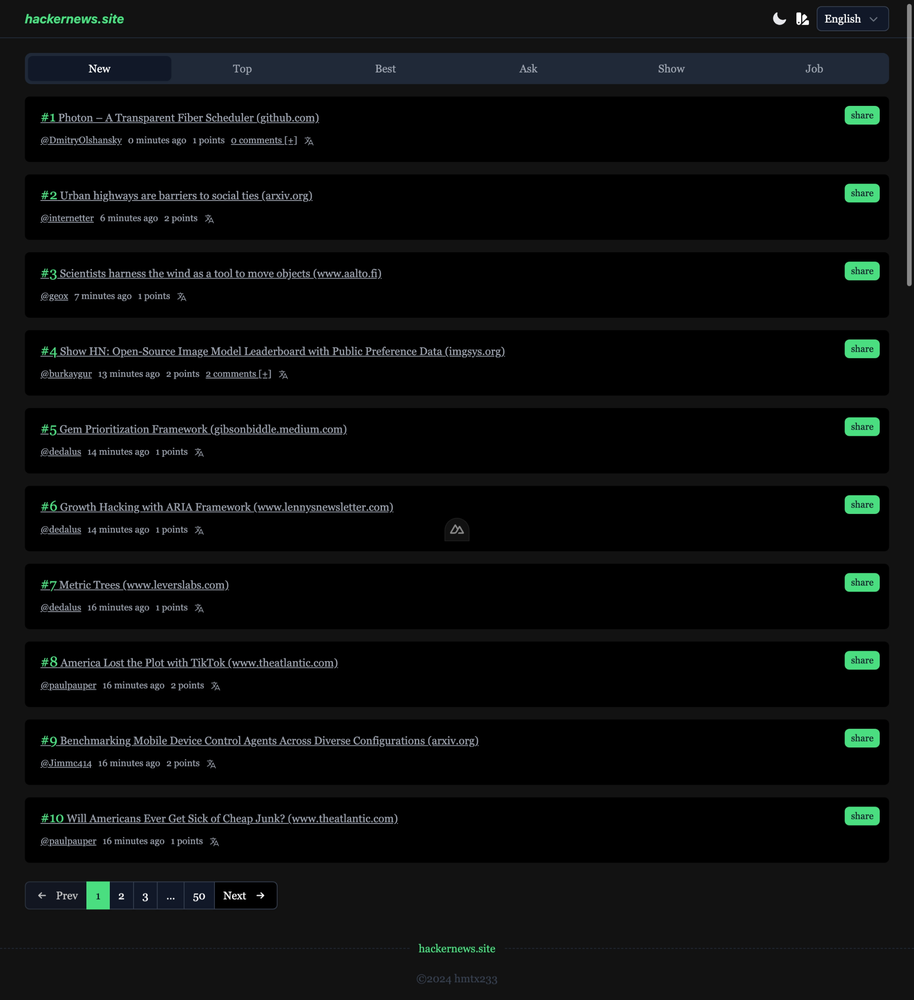
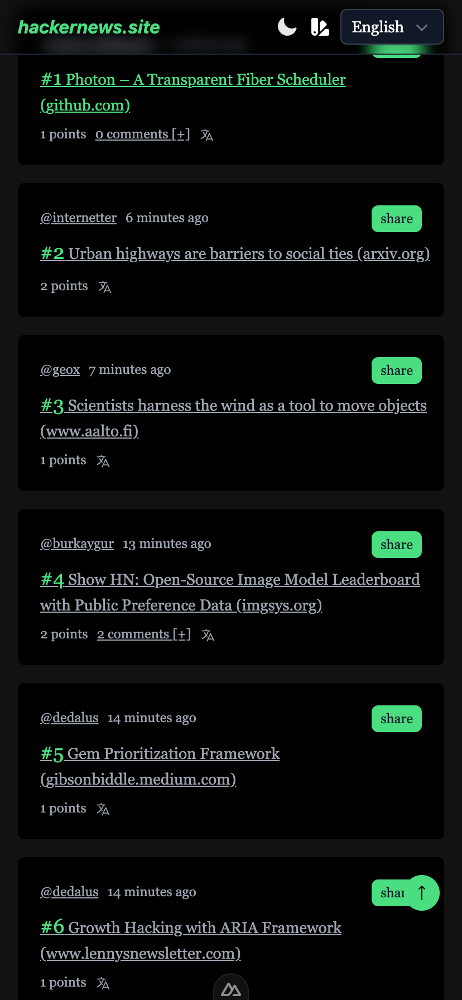

# hackeenews.site

> hackernews.com 站点镜像,国内开发者也可以访问

- tailwindcss 自适应
- nuxt3 http 3s缓存
- 部署在 cf  全球节点
- 腾讯翻译 每日/500w字免费 
> .env 下添加自己的TX_SECRET_ID和TX_SECRET_KEY 
```env
TX_SECRET_ID="TX_SECRET_ID" 
TX_SECRET_KEY="TX_SECRET_KEY"
``` 
## pc端

 

## 手机端
 


> 欢迎交流学习
